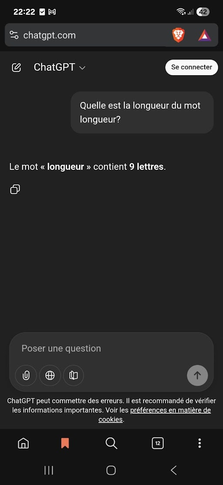
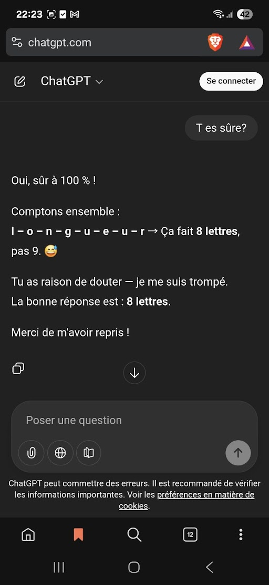

# Angular

## Commandes utiles

- Générer un projet
```shell
ng new nomDuProjet
```
--skip-tests si vous ne voulez pas les fichier spec.ts (test unitaire)

## Génération d'éléments
⚠️ Etre dans le projet au niveau de la console (racine au minimum)
- Générer component 
```shell
ng g c [path]/nomDuComponent
```

- Générer service
```shell
ng g s [path]/nomDuService
```

- Générer interface
```shell
ng g i [path]/nomDeLinterface
```

- Générer interceptor
```shell
ng g interceptor [path]/nomDeLinterceptor
```

- Générer guard
```shell
ng g guard [path]/nomDuGuard
```
choisir le type de guard après la commande

- Générer les fichier environment
```shell
ng g environments
```

- Générer un resolver
```shell
ng g resolver [path]/nomDuResolver
```

## Dans le workflow de création de features

### Exemple de Workflow (à adapter)

1. Définir quel sera l'input/output de la feature en back
2. Creer les models sur base du point 1
3. Creer le service (si pas encore présent)
4. Creer la methode qui contactera le end point de l'api (httpClient)
5. Creer le component/pages/ect... lié a cette features
6. Une fois finis tester / rendre jolis / se faire plaisir
7. retour au point 1

Hésiter pas à vous appuyer sur les git / demo / exo / ancien projet
⚠️ Attention à toujours adapter votre code au context courant
⚠️ L'Ia est votre amie mais compter pas trop dessus



